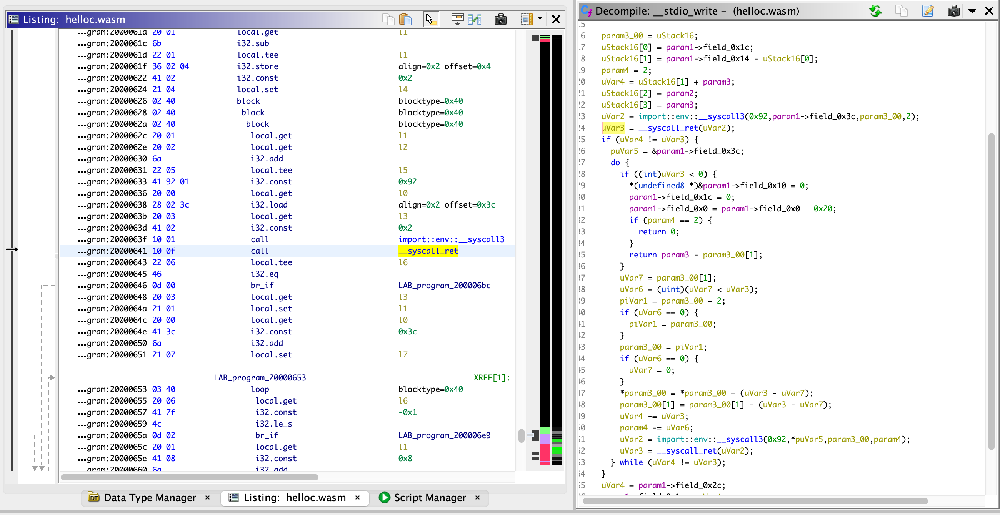

Module to load WebAssembly files into Ghidra, supporting disassembly and decompilation.

## Features

- Support for all WebAssembly 1.0 opcodes
- Cross-references for function calls and branches
- Cross-references for table entries and globals containing function pointers
- Recovery of the C stack, when the stack pointer is stored in a global variable (typical for compilers like Emscripten)

## Internals

This module uses a pre-analyzer (WasmPreAnalyzer) to analyze all functions and
opcodes, providing contextual information to the SLEIGH disassembler to enable
correct disassembly (for example, operand sizes when they depend on the types in
the value stack, branch target addresses, etc). In order to support recovery of
the C stack, this module converts Wasm stack operations into operations on a
register file. This frees up the decompiler's stack analysis to focus on the
behaviour of the C stack, since the decompiler only supports a single stack.
Additionally, parameter passing and returns are handled by virtual input/output
registers which are copied to/from the stack and locals registers via Pcode
injection.

## Limitations

- Currently, inlining functions (via marking them "In Line") is not supported
and will confuse the decompiler. This is because the inlined function's
references to stack and local variables will affect the caller. I tried to solve
this limitation by injecting code to save and restore stack and locals on
function entry/exit, but ran into a Ghidra limitation - the decompiler does not
inject "uponentry" Pcode into inlined functions.

- Currently, there is a bug with the decompiler (tracked as
NationalSecurityAgency/ghidra#3390) which causes it to produce bogus
decompilation under certain circumstances. For Wasm code, this seems to be
triggered with nested blocks that have non-empty type (i.e. blocks which leave a
return value on the stack). Compilers seem to prefer void blocks, though, so
this limitation does not appear to be severe in practice.

- Multiple return values are untested and will probably not work.

## Acknowledgements

- This plugin borrows loader functionality from this repo: https://github.com/andr3colonel/ghidra_wasm
- This plugin was directly based on https://github.com/garrettgu10/ghidra-wasm-plugin
